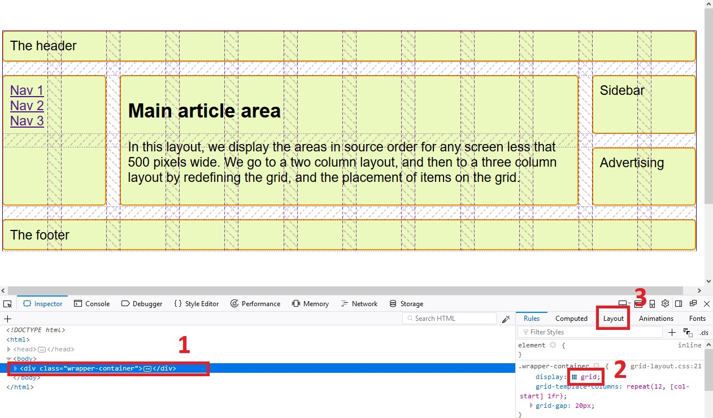

# CSS - rozloženie stránky
O css technikách na vytváranie rozloženia stránky (layout) som rozprával na prednáške, [slajdami si pripomeňte princípy](/prednasky/zdroje/04-WT-css-responzivny-dizajn.pdf). 

Ide najmä o:
  * obtekanie (float) 
  * umiestnenie (positioning)
  * mriežkové rozloženie (grid layout)

# Príklady na precvičenie

## Príklad 1

Stiahnite si súbory [grid-layout.css](zdroje/grid-layout.css) a [grid-layout.html](zdroje/grid-layout.html).
Ide o layout, ktorý som prezentoval a vysvetloval na prednáške. Vašou úlohou je prerobiť ho tak, aby bol tvorený z 12 stĺpcov (použitím CSS Grid Layout), pričom celkové rozloženie (jednotlivé oblasti) budú zachované.

*Firefox Quantum* má v *Dev Tools* funkciu - zobrazenie mriežky. Toto ilustrujem na priloženom obrázku. Keď vyberiete element, ktorý má definovanú vlastnosť `display:grid` (na obrázku krok 1), zobrazí sa ikonka mriežky v css pravidlách (na obrázku krok 2). Kliknutím na ikonu sa zobrazí mriežka tak, ako je definovaná. Kliknutím na kartu `Layout` (na obrázku krok 3) si môžete interaktívnou formou zvýraznovať jednotlivé časti celého "grid systému". Obrázok ilustruje 12 stĺpcovú mriežku, ktorú máte za úlohu vytvoriť.

## Príklad 2
Prerobte formulár z prednášky [css-tables.html](zdroje/css-tables.html), v ktorom sme použili CSS tabuľku (`display:table`) tak, že CSS tabuľku nahradíte CSS Grid Layoutom. 

## Príklad 3
Prerobte [tento príklad z Bootstrap stránky](http://v4-alpha.getbootstrap.com/examples/offcanvas/) tak, že použijete iba CSS Grid Layout, a teda nepoužijete Bootstrap Grid System. 

## Príklad 4
Otestujte sa - [Grid Garden](https://cssgridgarden.com/).
